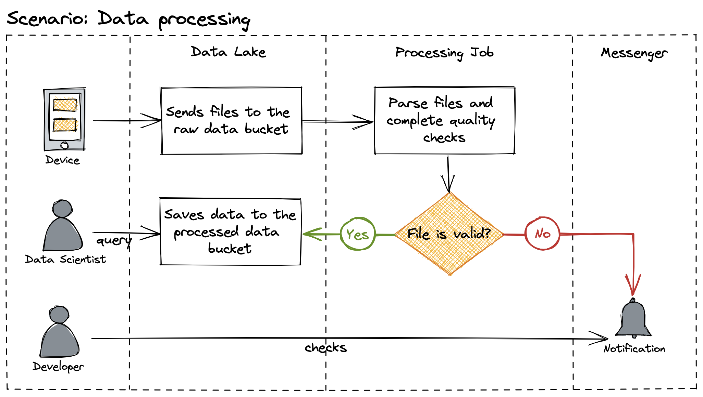
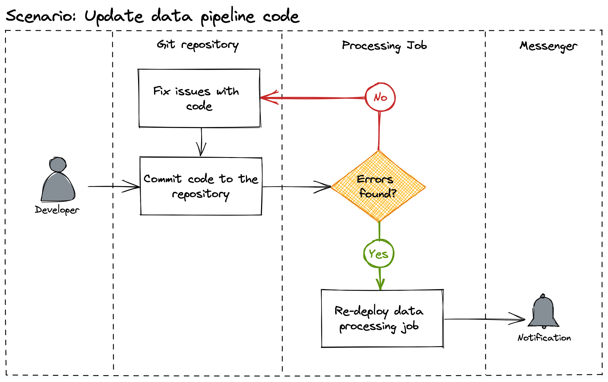
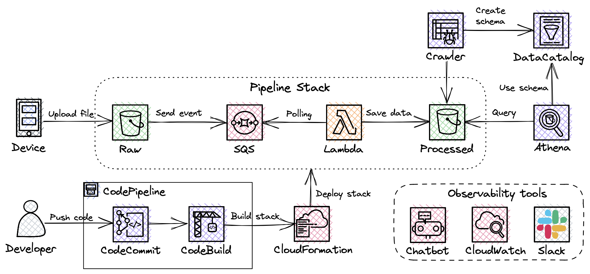

# Serverless data transformation pipeline
**Table of Contents**

- [Data pipeline requirements](#data-pipeline-requirements)
  * [Problem Context](#problem-context)
  * [Constraints](#constraints)
  * [Functional requirements](#functional-requirements)
  * [Non-functional requirements](#non-functional-requirements)
  * [Actors, actions and significant scenarios](#actors--actions-and-significant-scenarios)
- [Proposed solution](#proposed-solution)
  * [Architecture diagram](#architecture-diagram)
  * [Cost breakdown](#cost-breakdown)
  * [Deployment](#deployment)
- [Discarded solutions](#discarded-solutions)
- [ADRs](#adrs)

## Data pipeline requirements

### Problem Context

A group of data scientists are about to launch research study to develop new features on small subset of customers (up to 20). They requested a design of data parsing process and related automation subprocesses. The process is as follows: 

- ECG signal data is generated on device and sent to cloud
- Once data is gathered, it should be checked
- After successful checks, data should be transformed into specific format.
- Processed data should be exposed for future analysis using internal systems.

Also, data scientists have little to no experience in working with infrastructure so changes to application should be automatically deployed after committing them to git.

For process testing, you can use example dataset from Pławiak, Paweł (2017), “ECG signals (1000 fragments)”, Mendeley Data, V3, doi: 10.17632/7dybx7wyfn.3

### Constraints

- AWS is the preferred cloud provider
- Development team has limited capacity, so the solution should require minimal development and maintenance effort

### Functional requirements

- **FR-1** Application should parse binary proprietary format files
- **FR-2** Application should be triggered by file upload event
- **FR-3** Application should perform data quality checks
- **FR-4** Application should support access to data via SQL query
- **FR-5** Data should be stored in query-optimised format
- FR-6 Application should be updated automatically after git commit
- FR-7 Application should notify users if file processing fails via corporate messenger

### Non-functional requirements

- **NFR-1** Data scientists should be able to read and (to some extent) understand the implemented transformation logic
- **NFR-2** Structured and centralised logs should be implemented
- **NFR-3** The application should be able to scale in/out as the data volumes may vary during the day
- **NFR-4** Solution should be cost effective
- N**FR-5** Application should process data within 10 minutes

### Actors, actions and significant scenarios

| Actor | Actions |
| --- | --- |
| Device | - Send data to raw data bucket |
| Data scientist | - Query processed data |
| Developer | - Update data pipeline or CI/CD code   - Monitor data pipeline errors |

SS-1 Data processing

SS-2 Updata data pipeline code

## Proposed solution

> 💡 *Everything in software architecture is a trade-off. First Law of Software Architecture*

### Architecture diagram

---

All resources will be deployed as a Stack to allow centralised creation, modification and deletion of resources in any account. The process will be monitored by CloudWatch and all errors will be sent to Slack channel with help of AWS Chatbot. 

**Main process (Data Processing):**

- **Device** uploads *.mat* file with ECG data to S3 bucket (**Raw**)
- Upload triggers event creation which is sent to **SQS** queue.
- **Lambda** polls SQS queue (event mapping invocation) and starts processing event. Lamba’s runtime is Python Docker container because libraries’ size exceed layers’ size limit of 250 MB. If any error occurs in the process, you’ll get notification in **Slack**.
- Once completed, processed data in parquet format is saved to S3 Bucket (**Processed**).
- To enable data scientists to query the data, **Glue Crawler** job creates a schema in the **Data Catalog**. Then, **Athena** is used to query Processed bucket.

**Secondary process (CI/CD):**

When a developer wants to change processing job logic, he should just prepare the changes and commit them to the **CodeCommit** repository. Everything else is automated and handled by CI/CD process.

**CodeBuild** service converts CDK code into CloudFormation template and deploys it to your account. In other words, it creates all infrastructure components automatically. Once completed, deployed resources’ group (stack) is available in **CloudFormation** service on web UI. To simplify these two steps and provide self-updates for CI/CD process as well, **CodePipeline** abstraction is used. You’ll also get Slack notifications about the progress.

### Cost breakdown

| Service | Configuration | Monthly cost |
| --- | --- | --- |
| Amazon S3 | S3 standard (100 GB), S3 Glacier Flexible Retrieval (100 GB) | $2.88 |
| Amazon Athena | Data amount scanned is 900 GB (monthly) | $4.39 |
| AWS Lambda | Memory allocated 200 MB, 70,000 total compute seconds (monthly), amount of ephemeral storage allocated 512 MB | $0.23 |
| AWS CodePipeline | Pipelines (1) | $1.00 |
| AWS CodeBuild | Billed minutes 9 (monthly) | $0.09 |
| AWS Glue | Crawlers (1) with duration of 5 minutes | $0.04 |
| AWS CloudFormation | Third-party extension operations (0) | $0.00 |
| Amazon SQS | Requests per month 700 | $0.00 |
|TOTAL COST |  | $8.63 |

### Deployment

All infrastructure components are prepared using IaC tool - AWS CDK.

[CDK assets](cdk-assets/) 

## Discarded solutions

|  | Reason |
| --- | --- |
| Lambda | Data science libraries used in the process take more than 250 MB layers size in total |
| Fargate | Requires more development efforts, launch time takes 1-2 minutes |
| EC2 transient | Requires additional orchestration component and more development efforts, launch time takes 2-3 minutes |

## ADRs

> 💡 *Why is more important than how. Second Law of Software Architecture*

[01 Use markdown architectural decision records](ADRs/01-use-markdown-archtectural_decision-records.md)  
[02 Use AWS cloud provider](ADRs/02-use-aws-cloud-provider.md)  
[03 Use event driven launch for pipeline](ADRs/03-use-event-driven_launch.md)  
[04 Use CDK to deploy resources](ADRs/04-use-cdk-to-deploy-resources.md)  
[05 Use Parquet format](ADRs/05-use-parquet-format.md)  
[06 Use SQS service](ADRs/06-use-sqs-service.md)

